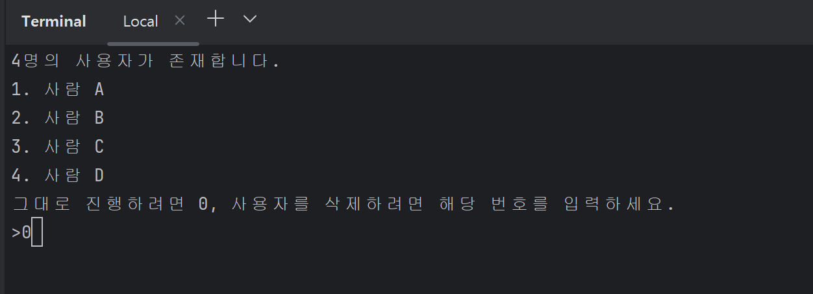
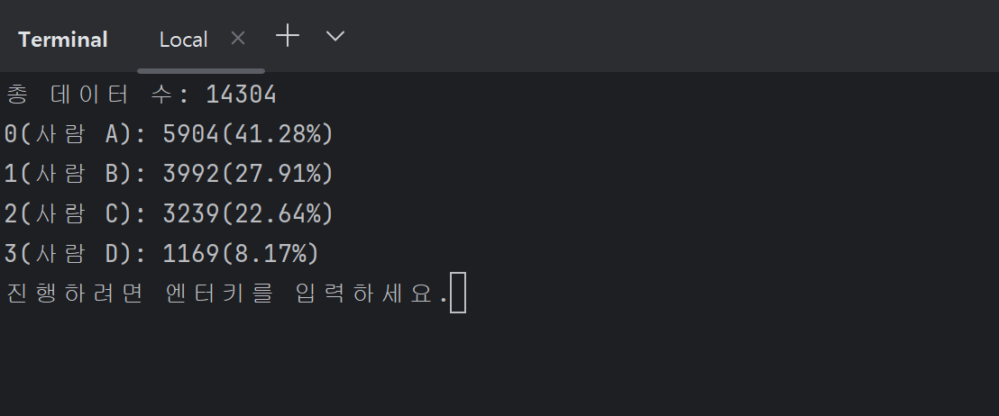
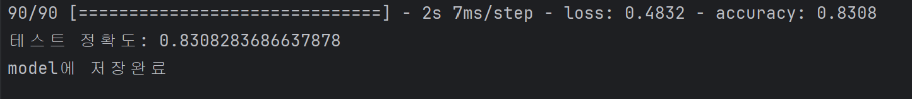
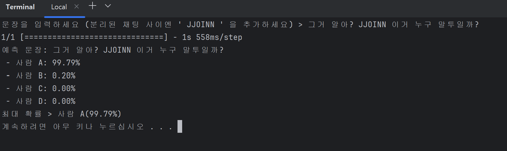

# IsThatYou

카카오톡의 대화 내용 데이터를 토대로 누구의 말인지 구분하는 모델을 훈련하고 테스트 할 수 있습니다.

> python 3.9 (conda 권장)
> 
> konlpy, tensorflow, keras, scikit-learn, pandas 모듈 설치가 필요합니다.

GRU를 사용한 모델입니다.

```txt
[Input]
 └─ (batch_size, MAX_LEN)
        ↓
[Embedding Layer]
 └─ Embedding(input_dim=vocab_size, output_dim=EMBEDDING_DIM)
 └─ 출력 shape: (batch_size, MAX_LEN, EMBEDDING_DIM)
        ↓
[GRU Layer]
 └─ GRU(units=HIDDEN_UNITS)
 └─ 출력 shape: (batch_size, HIDDEN_UNITS)
        ↓
[Dense Output Layer]
 └─ Dense(units=number_of_users, activation='softmax')
 └─ 출력 shape: (batch_size, number_of_users)

```

## 사용법

```cmd
python Train.py -f data.txt
```

data.txt는 본인의 파일로 입력하세요. 이후엔 아래의 화면들이 나타납니다.





> 데이터가 많고, 사람별로 데이터의 양이 균등할 때 정확도가 가장 높습니다. 위의 예시는 데이터의 양이 적절하지 않은 예시입니다.



이후 

```cmd
python run.py -p model
```

을 실행한 뒤 문자열을 입력하면



위와 같은 결과가 나옵니다.